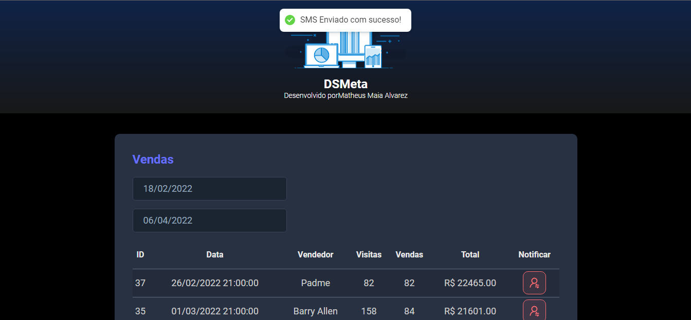
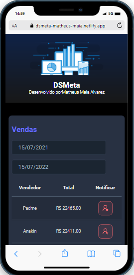

DSMeta - Relatório de Vendas e Notificações SMS

📝 Descrição do Projeto

O DSMeta é uma aplicação web full-stack desenvolvida durante a Semana Spring React da DevSuperior (Professor Nelio Alves). O principal objetivo deste projeto é fornecer um relatório de vendas robusto, permitindo que os usuários filtrem as vendas por período (data mínima e máxima) e enviem notificações via SMS para um número de telefone pré-configurado, utilizando a API da Twilio.

Este projeto consolida conhecimentos em desenvolvimento de APIs REST com Spring Boot e construção de interfaces reativas com React.

✨ Funcionalidades

Listagem de Vendas: Exibição de um relatório detalhado de vendas.

Filtro por Período: Capacidade de filtrar as vendas por um intervalo de datas específico (data mínima e data máxima).

Paginação: Implementação de paginação para navegar entre grandes volumes de dados de vendas.

Envio de Notificações SMS: Integração com a API da Twilio para enviar mensagens SMS sobre as vendas.

🚀 Tecnologias Utilizadas

Este projeto foi construído utilizando as seguintes tecnologias e ferramentas:

Backend
Linguagem: Java

Framework: Spring Boot

Spring Data JPA (para persistência de dados)

Spring Web (para a criação de APIs REST)

Banco de Dados: PostgreSQL (com H2 para testes em memória, se aplicável)

Ferramenta de Build: Maven

Integração: Twilio API (para envio de SMS)

Frontend
Linguagem: TypeScript

Framework/Biblioteca: React

Estilização: CSS / SCSS (com metodologias como BEM, se aplicável, ou Bootstrap)

Requisições HTTP: Axios

Outras: React Hooks, React Router DOM 

⚙️ Como Rodar o Projeto

Siga os passos abaixo para configurar e rodar o projeto localmente.

Pré-requisitos

Certifique-se de ter as seguintes ferramentas instaladas:

Java Development Kit (JDK) 17 ou superior

Maven

Node.js e npm/Yarn (para o frontend)

PostgreSQL (ou Docker para PostgreSQL)

Uma conta e credenciais na Twilio (SID da conta, Auth Token e número de telefone Twilio).

Configuração do Banco de Dados (Backend)
Crie um banco de dados PostgreSQL com o nome dsmeta (ou o nome que preferir).

Configure as credenciais do banco de dados no arquivo src/main/resources/application.properties ou application.yml do backend:

Properties

spring.datasource.url=jdbc:postgresql://localhost:5432/dsmeta
spring.datasource.username=YOUR_USERNAME
spring.datasource.password=YOUR_PASSWORD
(Substitua YOUR_USERNAME e YOUR_PASSWORD pelas suas credenciais do PostgreSQL).

Configuração da Twilio (Backend)
No mesmo arquivo de configuração (application.properties ou application.yml) do backend, adicione suas credenciais da Twilio:

Properties

twilio.sid=ACxxxxxxxxxxxxxxxxxxxxxxxxxxxxx
twilio.key=your_auth_token_here
twilio.phone.from=+1234567890
(Substitua pelos seus dados reais da Twilio).

Rodando o Backend
Clone o repositório:

Bash

git clone https://github.com/TiagoBaratieri/dsmeta.git
cd dsmeta
Navegue até a pasta do backend:

Bash

cd backend/ # (Se o backend estiver em uma subpasta 'backend/')
Construa o projeto com Maven:

Bash

mvn clean install
Execute a aplicação:

Bash

mvn spring-boot:run
A API estará disponível em http://localhost:8080.

Rodando o Frontend
Navegue até a pasta do frontend (em um novo terminal):

Bash

cd frontend/ # (Se o frontend estiver em uma subpasta 'frontend/')
Instale as dependências:

Bash

npm install # ou yarn install
Inicie a aplicação React:

Bash

npm start # ou yarn start
O frontend estará disponível em http://localhost:3000 (ou outra porta, se configurada).

📊 Screenshots / Demonstração

  
  

🤝 Contribuição

Contribuições são bem-vindas! Se você tiver sugestões, melhorias ou encontrar bugs, sinta-se à vontade para:

Abrir uma Issue.

Fazer um Fork.

Criar um Pull Request.

🎓 Aprendizado e Reconhecimento

Este projeto foi fundamental para solidificar conhecimentos em:

Desenvolvimento de APIs RESTful com Spring Boot.

Integração com APIs externas (Twilio).

Construção de interfaces reativas com React e TypeScript.

Consumo de APIs REST no frontend.

Manipulação de datas e filtros.

Agradecimento especial à DevSuperior e ao Professor Nelio Alves pelo excelente conteúdo e orientação durante a Semana Spring React.

